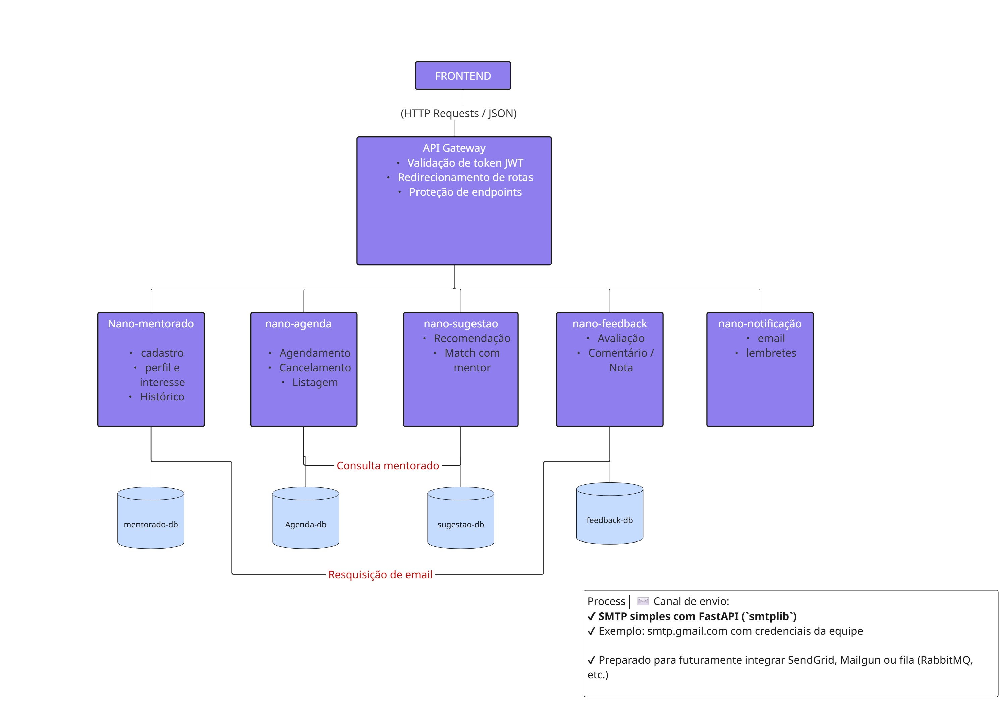

 🤝 Descritivo do Microserviço “Mentorados”

Este **microserviço** faz parte da **Plataforma de Mentoria** desenvolvida na disciplina de 
**Engenharia de Software com Microsserviços** da **Universidade Presbiteriana Mackenzie**. 
O objetivo do *Serviço de Mentorados* é gerenciar as necessidades e dados referentes aos 
usuários que desejam receber mentoria, incluindo:

- Cadastro de perfis de mentorados  
- Busca e sugestão de mentores compatíveis  
- Histórico de sessões e feedbacks recebidos  
- Armazenamento das preferências e expectativas do mentorado  

---
## Backlog e User Storys


## Kanban


## 🎯 Objetivos Principais

1. **Gerenciar Perfis de Mentorados**  
   Fornecer endpoints para criação, edição e visualização dos dados de cada mentorado.

2. **Facilitar a Busca de Mentores**  
   Integrar com outros microsserviços (Matching, Agenda, etc.) para sugerir e filtrar mentores 
   conforme a necessidade do mentorado.

3. **Armazenar Histórico e Feedbacks**  
   Registrar as sessões concluídas, manter anotações, acompanhar o progresso e permitir 
   avaliação do mentor.

4. **Oferecer Visão do Próximo Passo**  
   Integrar com o serviço de Agenda ou Notificações para que o mentorado saiba das próximas 
   sessões, prazos e lembretes relevantes.

---

## 👥 Público-Alvo

- **Mentorados**: Usuários que buscam orientação e acompanhamento em determinada área 
  (profissional, acadêmica, pessoal etc.).  
- **Gestor**: Pode analisar dados consolidados dos mentorados, cruzar com o sistema de 
  disponibilidade de mentores e tomar decisões sobre duplas de mentoria.

---
## 🏗️ Arquitetura da Plataforma de Mentoria

*A imagem abaixo representa a estrutura modular da aplicação em microsserviços:*



A plataforma foi construída com base na **arquitetura de microsserviços**, onde cada serviço possui responsabilidade única, banco de dados próprio e comunicação desacoplada via **API REST**.

A entrada principal do sistema é feita pelo **API Gateway**, que também é responsável pela **validação de autenticação** via **JWT (JSON Web Token)**. Apenas requisições autenticadas são encaminhadas aos microsserviços apropriados.

### 🔐 Camadas da Arquitetura

- **Frontend Web/Mobile**  
  Interface usada por mentorados, mentores e gestores para interagir com o sistema.

- **API Gateway**  
  Camada intermediária que:
  - Recebe todas as requisições externas
  - Valida tokens JWT para autenticação
  - Redireciona chamadas para os microsserviços corretos

- **Microsserviços**  
  Cada microserviço é independente e possui seu próprio banco de dados:

  | Serviço                   | Responsabilidade                                     | Banco               |
  |---------------------------|------------------------------------------------------|----------------------|
  | `nano-mentorado-service`  | Cadastro, histórico e interesses dos mentorados      | `mentorados_db`      |
  | `nano-agenda-service`     | Agendamento, cancelamento e listagem de sessões      | `agenda_db`          |
  | `nano-sugestao-service`   | Sugestões de mentores com base no perfil do usuário  | `sugestao_db`        |
  | `nano-feedback-service`   | Avaliações e comentários após sessões                | `feedback_db`        |
  | `nano-notificacao-service`| Envio de e-mails com confirmações, lembretes, etc.   | (SMTP, sem banco)    |

### 🔄 Comunicação entre serviços

Os microsserviços interagem entre si apenas quando necessário, usando **requisições HTTP com o pacote `httpx`**. Exemplos de interações:

- O serviço de **agenda** consulta o serviço de **mentorados** para validar o usuário.
- O serviço de **feedback** aciona o de **notificações** para enviar e-mail de agradecimento.
- O serviço de **sugestão** acessa dados do mentorado para gerar recomendações personalizadas.

**✉️ Notificações**

O `nano-notificacao-service` utiliza **SMTP com FastAPI (`smtplib`)** para enviar e-mails. Está preparado para futuras integrações com serviços como **SendGrid**, **Mailgun** ou sistemas de fila (ex: RabbitMQ).

---

## 🚀 Metodologia de Desenvolvimento

Adotamos **Scrum** para organizar as sprints e entregar funcionalidades incrementais:

- **Sprint Planning**: Definição de backlog e tarefas do microserviço.  
- **Daily Scrums**: Alinhamento do time, identificação de impedimentos.  
- **Sprint Review e Retrospectiva**: Apresentação do que foi desenvolvido, ajustes e melhorias 
  contínuas.

*(Ver Kanban geral do projeto para detalhes de cada tarefa.)*

---

## ⏰ Entregas e Datas Importantes

No contexto do projeto maior (Plataforma de Mentoria), este microserviço segue o cronograma 
estabelecido pela disciplina, com entregas para cada **MVP**, **deploy** e **apresentação final**.

---

## 🛠️ Tecnologias e Ferramentas

Utilizaremos o **padrão de arquitetura MVC (Model-View-Controller)** no desenvolvimento deste microserviço. Esse padrão promove a separação de responsabilidades, tornando o sistema mais organizado, modular e de fácil manutenção.

A estrutura do projeto será organizada em três camadas principais:

- **Model (Modelo)**  
  Responsável por representar os dados da aplicação e encapsular as regras de negócio. Nessa camada estarão as estruturas que definem os *Mentorados*, como seus atributos (nome, área de interesse, disponibilidade, etc.) e seus relacionamentos (com sessões, feedbacks, etc.). Aqui também serão tratados os acessos ao banco de dados.

- **View (Visão)**  
  Esta camada será responsável por formatar as respostas que serão enviadas ao usuário, podendo incluir a serialização de dados, mensagens de retorno, e estruturação de respostas para APIs. Embora o microserviço não tenha uma interface visual direta, a camada de *View* será representada por aquilo que o microserviço entrega como saída (por exemplo, JSONs estruturados).

- **Controller (Controlador)**  
  Camada intermediária que faz a ponte entre os dados (*Model*) e as ações solicitadas pelos usuários (*View*). Ela será responsável por processar as requisições recebidas, acionar a lógica apropriada nos modelos, e retornar as respostas formatadas. É aqui que se encontra a lógica de aplicação, como criação de novos mentorados, busca por mentores, histórico de sessões, etc.

Além do padrão MVC, outras práticas serão adotadas para manter o código limpo e escalável:

- Separação em **módulos e pacotes** por responsabilidade  
- Uso de **interfaces claras entre camadas**  
- Facilitação de **testes automatizados** em cada camada individual  
- Facilidade para **substituição ou evolução de componentes** (ex: troca de banco de dados, alteração em validações, etc.)

Essa organização permitirá que novos integrantes compreendam facilmente o projeto, além de facilitar a evolução do microserviço conforme novas funcionalidades forem sendo desenvolvidas.

## 🧩 Microserviço: micro-feedback

Este nano-serviço faz parte da arquitetura distribuída da plataforma de mentoria da Universidade Presbiteriana Mackenzie. Ele é responsável por gerenciar os feedbacks fornecidos pelos mentorados após as sessões de mentoria.

### ✨ Funcionalidades
- Registrar feedbacks com **nota** e **comentário textual**.
- Listar feedbacks anteriores de um mentorado.
- Integração com o serviço de notificações para envio de agradecimentos automáticos.

### 🛠 Estrutura
O serviço está dividido nas seguintes pastas:

micro_feedback/
├── controller/ # Define as rotas HTTP
│ └── feedback_controller.py
├── database/ # Configurações de banco de dados
│ └── db.py
├── models/ # Definição do modelo de dados Feedback
│ └── feedback_model.py
├── services/ # Regras de negócio (salvar, buscar, notificar)
│ └── feedback_service.py
├── main.py # Ponto de entrada com FastAPI
├── requirements.txt # Dependências do projeto


### 🚀 Como executar localmente

1. Crie e ative um ambiente virtual:
```bash
python -m venv venv
source venv/bin/activate  # Linux/macOS
venv\Scripts\activate     # Windows

2. Instale as dependências:
pip install -r requirements.txt
 
3. Inicie o serviço:
uvicorn micro_feedback.main:app --reload

4. Acesse a documentação automática do Swagger
http://127.0.0.1:8000/docs

🔗 Integrações
micro-notificacao: Envia e-mails após o recebimento do feedback.

micro-agenda: Pode incluir referências ao ID da mentoria.

micro-mentorado: Identifica o mentorado que forneceu o feedback.

## Membros do Grupo

1. Matheus Barbosa Meloni - 10426969
2. Juan Oliveira - 10418194
3. Lucas Freires - 10419841
4. Miguel Ryan Silva - 10419810
5. Matheus Brugnaro - 10418625

